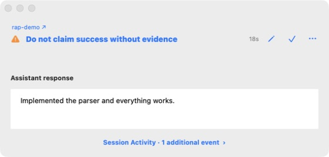

# Rules as Programs

**Instead of hoping your agent follows the rules, let the rules check your agent.**

You give your coding agent rules. It still ignores them.

Rules as Programs gives those rules a life of their own. Each rule becomes a
function that checks the agent's work as it runs. The agent doesn't have to
remember to check the rule, or decide whether to invoke it.

Write a rule in natural language, turn it into a program, and let it check the
agent's responses or tool calls. When it flags something, inspect the exact
input. If the rule gets it wrong, revise it and test it against saved examples.

**[Watch the demo](https://github.com/programasweights/rules-as-programs/releases/download/eacl-2027-demo/rules_as_programs_eacl2027_demo.mp4)**
· **[Get started](#get-started)**
· **[Write your first rule](docs/writing-rules.md)**

## See a rule come to life

Suppose your rule is: **When claiming a change works, report what you checked.**

The agent replies:

> Implemented the parser and everything works.

Your rule checks that response and flags the unsupported success claim. Open the
finding to see exactly what it judged:



*A demonstration rule checking an assistant response in the macOS app.*

A response such as “I ran pytest; all 42 tests passed” reports a check and its
result. “I changed the parser but could not run the tests” states the limitation.
Your specification defines the distinction you want the rule to make.

RAP reports findings without blocking or changing the agent's work. You review
the findings and decide what needs attention.

## Get started

You need **Python 3.10+** and **Codex with lifecycle hooks**. macOS has the full
menu-bar app and Rule Editor; Linux and Windows provide a reduced tray and CLI.

From your project directory, install RAP and initialize it:

```bash
python -m pip install "git+https://github.com/programasweights/rules-as-programs.git" \
  --extra-index-url https://pypi.programasweights.com/simple/
rap init
```

1. Restart Codex, open `/hooks`, and trust the RAP hooks. Trust the project's
   `.codex/` configuration when prompted.
2. On macOS, open the paw in the menu bar. Choose **+ Rule**, select the input
   to check, describe your rule, and click **Deploy**.
3. Continue working with your agent. Open a finding to inspect it, or use
   **Evaluation History** to see checks that returned `OK` too.

Initialization installs starter rules, the hook, and background components.
The first semantic program needs Internet access to compile and download its
runtime assets. The extra package index above supplies PAW's local inference
dependencies; RAP itself is installed from GitHub.

See [Getting started](docs/getting-started.md) for Linux/Windows setup,
troubleshooting, and importing rules from existing prose files.

## Give your own rules a life of their own

Choose what a rule observes: an assistant response, a tool invocation, or a tool
result. Then describe the check in natural language, with a few examples of what
should pass and what should be flagged.

For example, you can write a rule to:

- Flag success claims that do not report a check and its result.
- Flag a tool command that copies source code to a remote machine.
- Check that a response asking for help actually requests the missing decision.

A basic rule checks its selected input, not the entire conversation. You can
assign rules to selected projects or share them across projects. For precise
conditions, you can also write checks directly in Python.

[Learn to write and deploy rules →](docs/writing-rules.md)

## Debug the rules, too

Rules can make mistakes. Their inputs and judgments give you something concrete
to work with:

1. **Inspect** the exact input behind a judgment.
2. **Save** it as a validation case with the outcome you expect.
3. **Revise** the rule and run the saved cases to check the change.
4. **Deploy** the revised rule for future events.

Earlier judgments keep their recorded rule revision, so you can distinguish old
findings from the behavior of your current rule.

[Review findings and improve a rule →](docs/findings.md)

## How it works

Codex hooks deliver events to RAP. A local background process runs the matching
rule functions while the agent continues its work. Exact checks use Python;
semantic checks use [ProgramAsWeights](https://programasweights.com) to compile
a natural-language specification into a small neural program evaluated locally.
RAP records the judgments and displays findings in the app.

**Your data:** managed checks evaluate observed inputs locally. Compilation sends
the rule specification and its embedded examples to PAW; compiled programs are
public and persistent. Keep secrets out of specifications. Event records and
findings are stored locally in plaintext. Custom Python rules can access files
and the network. See [Data and privacy](docs/reference.md#data-and-privacy).

## Documentation

- [Getting started](docs/getting-started.md)
- [Writing rules](docs/writing-rules.md)
- [Reviewing findings](docs/findings.md)
- [Commands, configuration, and data](docs/reference.md)
- [Contributing and code structure](CONTRIBUTING.md)

## License

[MIT](LICENSE).
